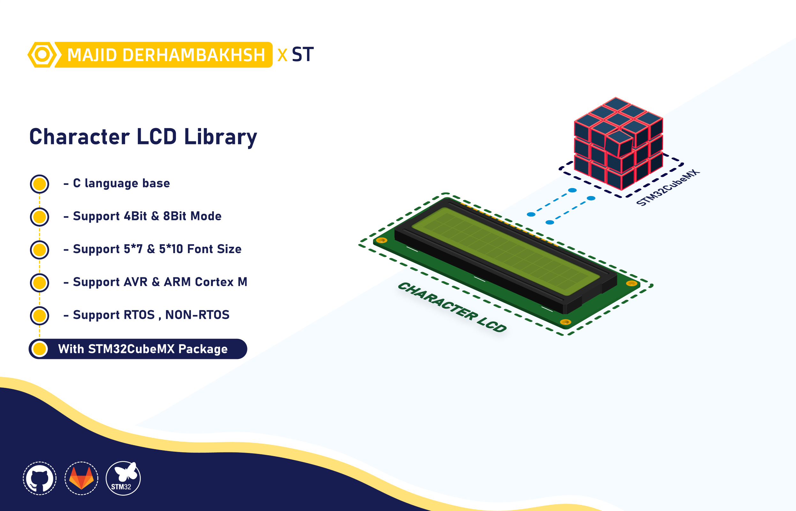

# Character-LCD
Character LCD library for use in AVR - ARM Cortex M

### Version : 1.0.0

- #### Type : Embedded Software.

- #### Support :  
               - AVR series  
               - ARM STM32 series  

- #### Program Language : C/C++

- #### Properties :

- #### Changes :  
               - Add: Support Pin Mapping
               - Add: Support speed optimization
               - Add: Support CGRAM memory and custom characters
               - Add: Support FLASH memory to reduce RAM memory usage
               - Add: Support RTOS mode  
               - Improve: Reduce memory usage by up to 70%

               - Add: First STM32Cube Package  

- #### Required Library/Driver :
  GPIO Unit (added in library for AVR) : [GPIO Unit](https://github.com/Majid-Derhambakhsh/gpio-unit)  


### Initialization and de-initialization functions:
```c++
void LCD_Init(void);
void LCD_Init2(LCD_TypeDef *pLCD);
void LCD_DefInit(void);
``` 

### LCD operation functions:
```c++
void LCD_PutChar(uint8_t ch);
void LCD_PutCMD(uint8_t ch);
void LCD_PutString(char *str);
void LCD_PutStringF(const char *str);
void LCD_Clear(void);
void LCD_GotoXY(uint8_t Column, uint8_t Row);
void LCD_Shift(uint8_t Shifts, LCD_CMDTypeDef Dir, uint16_t DelayTime);
void LCD_StoreInCGRAM(uint8_t *CharMap, char Code);
void LCD_StoreInCGRAMF(const uint8_t *CharMap, char Code);
void LCD_PutCustomChar(uint8_t *CharMap, char Code, uint8_t Column, uint8_t Row);
``` 

### Macros:
```c++
/* ~~~~~ Configurations ~~~~~ */
#define LCD_MODE   LCD_MODE_x
#define LCD_FONT   LCD_FONT_x
#define LCD_LINES  LCD_DISPLAY_LINE_x

/* ~~~~~~ Control Pins ~~~~~~ */
#define LCD_RS_GPIO GPIOx
#define LCD_RS_PIN  x

#define LCD_RW_GPIO GPIOx
#define LCD_RW_PIN  x

#define LCD_EN_GPIO GPIOx
#define LCD_EN_PIN  x

/* ~~~~~~~~ Data Pins ~~~~~~~ */
#define LCD_D0_GPIO GPIOx
#define LCD_D0_PIN  x

#define LCD_D1_GPIO GPIOx
#define LCD_D1_PIN  x

#define LCD_D2_GPIO GPIOx
#define LCD_D2_PIN  x

#define LCD_D3_GPIO GPIOx
#define LCD_D3_PIN  x

#define LCD_D4_GPIO GPIOx
#define LCD_D4_PIN  x

#define LCD_D5_GPIO GPIOx
#define LCD_D5_PIN  x

#define LCD_D6_GPIO GPIOx
#define LCD_D6_PIN  x

#define LCD_D7_GPIO GPIOx
#define LCD_D7_PIN  x

/* ~~~~~~~~ Optimize ~~~~~~~~ */
/* If you use the same port for data pins, uncomment this line */
//#define LCD_DATA_PORT_OPTIMIZE

/* ~~~~~~~~ STM32 MCU ~~~~~~~ */
#define STM32F1

/* ~~~~~~~~~ SYSTEM ~~~~~~~~~ */
#define LCD_USE_FREE_RTOS   0
``` 

## How to use this library

### The LCD library can be used as follows:
1.1  LCD configuration in the character_lcd_conf.h header, for example:  
         
```c++
//* ~~~~~~~~~~~~~~~~~~ Options ~~~~~~~~~~~~~~~~~~ */
/* ~~~~~ Configurations ~~~~~ */
#define LCD_MODE   LCD_MODE_4
#define LCD_FONT   LCD_FONT_5X7
#define LCD_LINES  LCD_DISPLAY_LINE_2

/* ~~~~~~ Control Pins ~~~~~~ */
#define LCD_RS_GPIO GPIOB
#define LCD_RS_PIN  3

#define LCD_RW_GPIO GPIOC
#define LCD_RW_PIN  4

#define LCD_EN_GPIO GPIOB
#define LCD_EN_PIN  0

/* ~~~~~~~~ Data Pins ~~~~~~~ */
#define LCD_D0_GPIO GPIOB
#define LCD_D0_PIN  1

#define LCD_D1_GPIO GPIOB
#define LCD_D1_PIN  2

#define LCD_D2_GPIO GPIOD
#define LCD_D2_PIN  5

#define LCD_D3_GPIO GPIOC
#define LCD_D3_PIN  0

#define LCD_D4_GPIO GPIOD
#define LCD_D4_PIN  1

#define LCD_D5_GPIO GPIOC
#define LCD_D5_PIN  1

#define LCD_D6_GPIO GPIOD
#define LCD_D6_PIN  2

#define LCD_D7_GPIO GPIOD
#define LCD_D7_PIN  3
```  
      
2.1  Initialize:  
        
```c++
LCD_Init();
```  
      
3.1  Using LCD operation functions, for example:  
```c++
   int main()
   {

      LCD_Init();
      
      /* Show character */
      LCD_Clear();
      LCD_PutChar('A');
      HAL_Delay(1000); // delay_ms(1000)

      while (1)
      {
        
        LCD_Clear();
        LCD_GotoXY(0,0);
        LCD_PutString("Hello");
        LCD_Shift(11, LCD_SHIFT_TO_RIGHT, 1000);
        LCD_Shift(11, LCD_SHIFT_TO_LEFT, 1000);
        HAL_Delay(1000); // delay_ms(1000)
        
      }
   }
       
```

#### Developer: Majid Derhambakhsh

